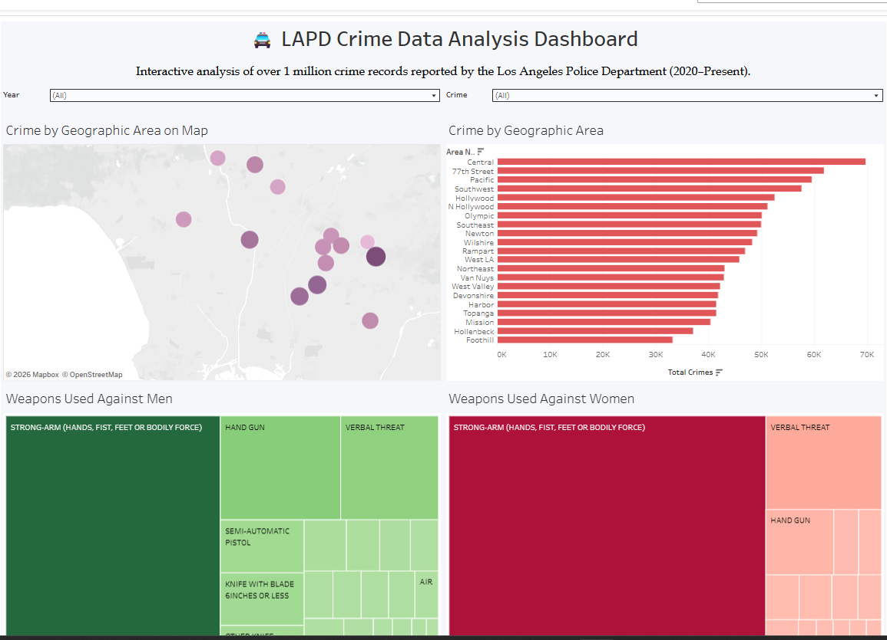
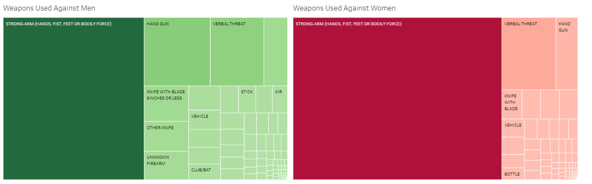
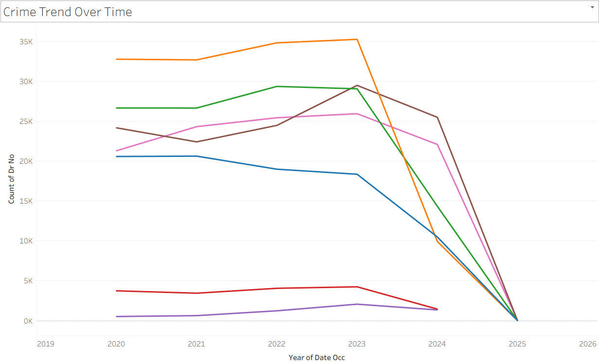
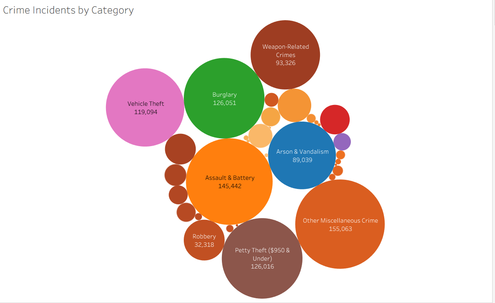

# 🚔 LAPD Crime Data Analysis Dashboard

> 🚀 **Interactive Tableau Dashboard:**  
> https://public.tableau.com/app/profile/harshada.jadhav8824/viz/LAPDCrimeDataAnalysisDashboard/LAPDCrimeDataAnalysisDashboard

> 💻 **GitHub Repository:**  
> https://github.com/harshadajadhav25/Crime-Data-Analysis

---

# Project Overview

Crime analysis plays a critical role in helping law enforcement agencies understand crime patterns, allocate resources effectively, and improve public safety.

This project analyzes **1M+ crime records** reported by the **Los Angeles Police Department (LAPD)** between **2020 and 2024**. Using Python for data preparation and Tableau for visualization, the project identifies crime hotspots, temporal crime patterns, victim demographics, weapon usage, and geographic crime distribution through an interactive dashboard.

The project follows a complete data analytics workflow, including:

- Data Cleaning
- Exploratory Data Analysis (EDA)
- Feature Engineering
- Business KPI Analysis
- Interactive Tableau Dashboard Development
- Crime Trend Analysis
- Geographic Crime Analysis

---

# Live Interactive Dashboard

Explore the complete interactive Tableau dashboard:

🔗 **Tableau Public**

https://public.tableau.com/app/profile/harshada.jadhav8824/viz/LAPDCrimeDataAnalysisDashboard/LAPDCrimeDataAnalysisDashboard

---

# Dashboard Preview

<p align="center">
    
</p>

---

# Project Structure

```text
Crime-Data-Analysis/
│
├── dashboard/
│   └── LAPD_Crime_Analytics_Dashboard.twbx
│
├── data/
│   ├── crime_data_sample.csv
│   └── cleaned_crime_data.csv
│
├── notebooks/
│   └── Crime Data Analysis.ipynb
│
├── images/
│   ├── dashboard_preview.png
│   ├── weapons_by_gender.png
│   ├── crime_by_hour.png
│   ├── top_crime_category.png
│
├── README.md
└── .gitignore
```

---

# Technologies Used

- Python
- Pandas
- NumPy
- SQL
- Tableau Public
- Jupyter Notebook

---

# Dataset

**Los Angeles Police Department (LAPD) Crime Data**

Source:

Los Angeles Open Data Portal

Dataset:

Crime Data from 2020 to Present

Dataset Summary:

- 1 Million+ Crime Records
- 28 Attributes
- Crime Type
- Crime Location
- Victim Demographics
- Weapon Information
- Date & Time
- Police Division

---

# Data Analytics Workflow

- Data Cleaning
- Missing Value Handling
- Duplicate Removal
- Feature Engineering
- Time-Based Analysis
- Geographic Analysis
- Crime Category Analysis
- Interactive Dashboard Development

---

# Dashboard Features

The interactive Tableau dashboard enables users to explore:

- 📍 Crime Hotspots Across Los Angeles
- 📈 Crime Trends Over Time
- 🕒 Hourly Crime Analysis
- 👥 Victim Demographics
- 🔫 Weapons Used
- 🌍 Geographic Crime Distribution
- 📊 Crime Categories
- 📅 Time-of-Day Crime Patterns

Interactive filters include:

- Crime Category
- Year
- Victim Gender
- Geographic Area

---

# Dashboard Visualizations

## 👥 Victims by Gender

Visualizes the distribution of crime victims by gender.

---

## 🔫 Weapons Used Against Men

Treemap illustrating the most frequently used weapons against male victims.

---

## 🔫 Weapons Used Against Women

Treemap illustrating the most frequently used weapons against female victims.

---

## 📊 Weapon Variation by Gender

Compares weapon usage across different victim genders.

---

## 🌍 Crime Incidents by Category

Packed bubble chart summarizing major crime categories.

---

## 📈 Crime Trend Over Time

Displays yearly crime trends across major crime categories.

---

## 📊 Crime Trend Heatmap

Highlights yearly crime distribution using a heatmap.

---

## 📍 Crime by Geographic Area

Ranks police divisions by crime volume.

---

## 🗺 Crime Hotspots

Interactive geographic visualization showing crime concentration across Los Angeles.

---

## 🕒 Hourly Crime Trend by Victim Gender

Analyzes hourly crime occurrence across victim genders.

---

## ⏰ Total Crimes by Time of Day

Summarizes crimes by Morning, Afternoon, Evening, Night, and Early Morning.

---

## 📅 Time of Day Crime Heatmap

Shows crime intensity by day of week and hour of day.

---

# Sample Visualizations

## 🔫 Weapons Used by Gender

<p align="center">

</p>

---

## 🕒 Crime by Hour of Day

<p align="center">

</p>

---

## 🌍 Top Crime Categories

<p align="center">

</p>

---

# Key Findings

- Analyzed more than **1 million crime incidents** reported by LAPD.
- Central Area recorded the highest overall crime volume.
- Assault & Battery represented one of the largest crime categories.
- Weapon usage differed significantly between male and female victims.
- Crime occurrences peaked during afternoon and evening hours.
- Geographic analysis revealed multiple crime hotspots across Los Angeles.
- Temporal analysis identified changes in crime patterns between 2020 and 2024.

---

# Business Value

This dashboard enables organizations to:

- Identify crime hotspots
- Analyze temporal crime patterns
- Improve police resource allocation
- Understand victim demographics
- Monitor weapon-related crime
- Support data-driven public safety decisions

---

# Large Dataset Downloads

Due to GitHub's file size limitations, the complete datasets are hosted externally.

### Full Dataset

https://drive.google.com/file/d/1PIJ_RnvUV77WFqUuUg_RPOEJfw9mcWrx/view?usp=sharing

### Cleaned Dataset

https://drive.google.com/file/d/1Zuk4Yl3SE8YYo_cYw7L47GwGbdRNlt7R/view?usp=sharing

---

# Installation

Clone the repository

```bash
git clone https://github.com/harshadajadhav25/Crime-Data-Analysis.git
```

Navigate into the project

```bash
cd Crime-Data-Analysis
```

Open the Tableau workbook

```text
dashboard/LAPD_Crime_Analytics_Dashboard.twbx
```

Or launch the Jupyter Notebook

```bash
jupyter notebook
```

---

# Future Improvements

- Automated ETL Pipeline
- Real-Time Crime Dashboard
- Cloud Deployment
- GIS Mapping Enhancements
- Predictive Crime Hotspot Analysis
- Machine Learning-Based Crime Forecasting
- Power BI Dashboard Version
- Historical Crime Trend Analysis

---

# Author

**Harshada Jadhav**

🔗 LinkedIn

https://www.linkedin.com/in/harshada-jadhav/

💻 GitHub

https://github.com/harshadajadhav25

📊 Tableau Public

https://public.tableau.com/app/profile/harshada.jadhav8824